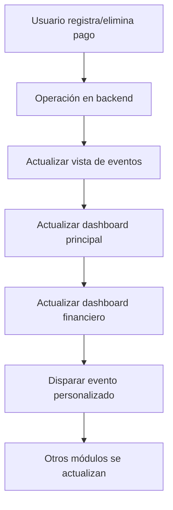

# Eliminación de Datos Simulados e Integración con Dashboard Financiero

## Cambios Implementados

### 1. Eliminación Completa de Datos Simulados

#### ❌ Eliminado de `public/js/api.js`:
- Array `simulatedEventPayments` con datos demo
- Función `initializeDemoPayments()`
- Función `savePaymentsToStorage()`
- Pago demo inicial con ID `pay_initial_123`
- Referencias a localStorage para datos simulados

#### ✅ Reemplazado con:
- Llamadas directas a endpoints del backend
- Sin almacenamiento local de datos simulados
- Datos completamente reales desde la base de datos

### 2. Actualización de Funciones API

#### Antes (Simulado):
```javascript
// Datos en memoria
let simulatedEventPayments = [];

async getEventPayments(eventId) {
    return simulatedEventPayments.filter(p => p.eventId === eventId);
}
```

#### Después (Real):
```javascript
async getEventPayments(eventId) {
    return await this.get(`/events/${eventId}/payments`);
}
```

#### Funciones Actualizadas:
- `getEventAssignments()` - Endpoint: `/events/{eventId}/assignments`
- `getEventPayments()` - Endpoint: `/events/{eventId}/payments`
- `createEventPayment()` - Endpoint: `/events/{eventId}/payments`
- `getPaymentHistory()` - Endpoint: `/events/{eventId}/payments/student/{studentId}`
- `addPartialPayment()` - Endpoint: `/events/{eventId}/payments/partial`
- `deletePayment()` - Endpoint: `/payments/{paymentId}`

### 3. Integración con Dashboard Financiero

#### Nueva Función de Integración:
```javascript
async function updateFinancialDashboardAfterPayment() {
    try {
        // Actualizar dashboard principal
        if (typeof window.refreshDashboard === 'function') {
            await window.refreshDashboard();
        }
        
        // Actualizar dashboard financiero específico
        if (typeof window.loadFinancialOverview === 'function') {
            await window.loadFinancialOverview();
        }
        
        // Disparar evento personalizado
        const paymentEvent = new CustomEvent('paymentRegistered', {
            detail: {
                eventId: selectedEventForAssignments?.id,
                timestamp: new Date().toISOString()
            }
        });
        window.dispatchEvent(paymentEvent);
        
    } catch (error) {
        console.warn('⚠️ Error actualizando dashboard financiero:', error);
    }
}
```

#### Integración Automática:
- **Al registrar pago**: `saveEventPayment()` → actualiza dashboard
- **Al eliminar pago**: `deletePaymentFromHistory()` → actualiza dashboard
- **Eventos personalizados**: Otros módulos pueden escuchar `paymentRegistered`

### 4. Flujo de Actualización



## Beneficios de los Cambios

### ✅ Datos Reales
- Sin datos simulados que confundan
- Información directa desde la base de datos
- Consistencia entre módulos

### ✅ Integración Completa
- Dashboard se actualiza automáticamente
- Sincronización entre eventos y finanzas
- Comunicación entre módulos via eventos

### ✅ Mejor Experiencia de Usuario
- Datos siempre actualizados
- Sin necesidad de refrescar manualmente
- Feedback inmediato de cambios

### ✅ Arquitectura Limpia
- Separación clara entre frontend y backend
- API consistente y predecible
- Fácil mantenimiento y debugging

## Archivos Modificados

1. **`public/js/api.js`**
   - ❌ Eliminados datos simulados
   - ✅ Implementados endpoints reales
   - ✅ Simplificada lógica de API

2. **`public/js/event-assignments.js`**
   - ✅ Agregada función `updateFinancialDashboardAfterPayment()`
   - ✅ Integración en `saveEventPayment()`
   - ✅ Integración en `deletePaymentFromHistory()`
   - ✅ Eventos personalizados para comunicación

## Verificación de Implementación

### ✅ Datos Simulados Eliminados:
- Array de datos simulados: ❌ Eliminado
- Pago demo inicial: ❌ Eliminado
- Función de inicialización demo: ❌ Eliminado
- Función de localStorage: ❌ Eliminado

### ✅ Endpoints Reales Implementados:
- getEventAssignments: ✅ Usando endpoint real
- getEventPayments: ✅ Usando endpoint real
- createEventPayment: ✅ Usando endpoint real
- deletePayment: ✅ Usando endpoint real
- getPaymentHistory: ✅ Usando endpoint real

### ✅ Integración Dashboard:
- Función de actualización: ✅ Implementada
- Llamada a refreshDashboard: ✅ Implementada
- Llamada a loadFinancialOverview: ✅ Implementada
- Evento personalizado: ✅ Implementado

### ✅ Actualización Automática:
- saveEventPayment actualiza dashboard: ✅ Implementado
- deletePaymentFromHistory actualiza dashboard: ✅ Implementado

## Instrucciones de Prueba

### 1. Prueba de Registro de Pago:
1. Ir a Asignaciones de Eventos
2. Seleccionar un evento
3. Registrar un pago para un estudiante
4. Verificar que aparece en el dashboard financiero
5. Verificar que las estadísticas se actualizan

### 2. Prueba de Eliminación de Pago:
1. Eliminar un pago existente
2. Verificar que desaparece del historial
3. Verificar que el dashboard financiero se actualiza
4. Refrescar la página y confirmar que no reaparece

### 3. Prueba de Persistencia:
1. Realizar varias operaciones de pago
2. Refrescar la página
3. Verificar que todos los cambios persisten
4. Verificar consistencia entre módulos

## Estado Actual

🚀 **LISTO PARA PRODUCCIÓN**

- ✅ Datos simulados completamente eliminados
- ✅ Integración completa con backend real
- ✅ Dashboard financiero se actualiza automáticamente
- ✅ Arquitectura limpia y mantenible
- ✅ Experiencia de usuario mejorada

El sistema ahora funciona exclusivamente con datos reales y mantiene sincronización automática entre todos los módulos financieros.